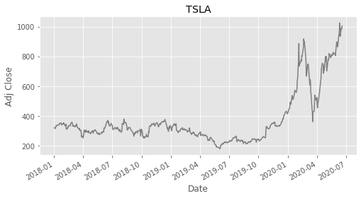
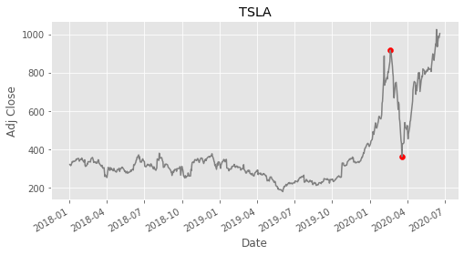
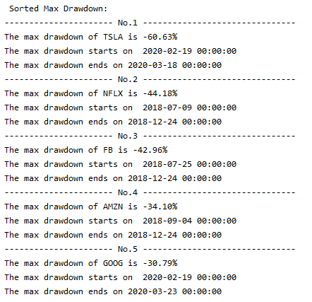
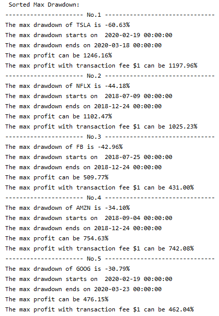

# Algorithms Implementation in Financial Applications

## Use many different popular algorithms to develop 3 financial applications: TradeAssistant, PortfolioAssistant, CurrencyMarketAssistant
## Algorithms include: divide and conquer, sorting, multithreading, greedy algorithms, dynamic programming, Dijkstra shortest path tree, and Kruskal minimal spanning tree.

### author: Yi Rong
### date: 01/27/20
---
### 1. TradeAssistant

#### 1.1. TradeAssistant Data Source

The constructor of TradeAssistant can connect with data source, like yahoo finance, and download daily time series data for a stock or another asset. This part can accept three parameters, which are a list of asset symbols, start date, and end date. An example about Tesla from 01/01/18 to 06/18/20 is shown below:



And the output is a list which contains two elements. The first one is a dictionary, which has symbol as key and time series data as value. The second one is a list and each element is a time series data. An example about downloading Tesla, Facebook, Netflix, Amazon and Google daily data from 01/01/18 to 07/01/20 is shown below.

Input: 

L_symbol = ["TSLA", "FB", "NFLX", "AMZN", "GOOG"]

TA = TradeAssistant(L_symbol=L_symbol, start=dt.datetime(2018, 1, 1), end=dt.datetime(2020, 7, 1))

Output: [a_dictionary, a_list]


#### 1.2. Divide and Conquer: Max drawdown(mdd) 

Max drawdown(mdd) is a risk measurement that computes the largest percentage loss based on a certain period of a time series data. For each time point, only the previous data can be considered. Also, to calculate mdd, we need to know the peak and trough and the trough should appear later than the peak. There are two steps to calculate mdd.

Input (time series):

For example, the time series for Tesla from 01/01/15 to 06/18/20 can be taken as an input or a list like [10, 9, 8, 9, 12] is accepted as well.

Step 1 (Get cumulative max series and its index):

For each element in the output of this step, the first value is the cumulative max, the second value is its index. For example, 

Input: [10, 9, 8, 9, 12]

output: [[10, 0], [10, 0], [10, 0], [10, 0], [12, 4]]

Step 2 (Get max drawdown and its start index and end index):

There are two inputs in this step. The first one is the original time series and the second one is the cumulative max series. To get the drawdown series, we just need to divide the original time series by the cumulative max series and minus one. Then, we need to find the minimal value among the drawdown series and the start and end index for the max drawdown period. For example,

Input1: [ 10,       9,       8,       9,      12    ]

Input2: [[10, 0], [10, 0], [10, 0], [10, 0], [12, 4]]

drawdown series: 

[   0,     -10%,    -20%,    -10%,      0    ]

Output [start_index, end_index, mdd]: [0, 2, -20%] 

#### 1.3. Illustrative Output of Divide and Conquer
From the Tesla example above, we can use mdd to get a result as [535, 555, -0.6063], which means the max drawdown is -60.63%. Then, the main function will print results and the console will show it as below.
 
The two data points can be visualized below and it is obvious to confirm that the drawdown between the two red points is maximal.



#### 1.4. Code for Divide and Conquer
```
# Step 1
def get_cummax(self):
"""
Intent: get a cumulative max series and index of max.
"""    
	i, i_max = 0, 0
    returnL = []
    cur_max = self.ts[i]
    while i < len(self.ts):
        if cur_max < self.ts[i]:
            cur_max = self.ts[i]
            i_max = i
        returnL.append([cur_max, i_max])
        i += 1
    return returnL


# Step 2: Divide and Conquer
def get_mdd_between(self, L_cummax, a_begin, an_end):
"""
Intent: find the minimal value among a drawdown series and the start 
and end index of the max drawdown using divide and conquer
"""
	returnL = [None] * 3

    if a_begin == an_end: # immediately satisfy all postconditions
        returnL[0] = L_cummax[a_begin][1]
        returnL[1] = a_begin
        returnL[2] = self.ts[a_begin] / L_cummax[a_begin][0] - 1
        return returnL
    else:
        mid = int((a_begin + an_end) / 2)

    left_res = self.get_mdd_between(L_cummax, a_begin, mid)

    right_res = self.get_mdd_between(L_cummax, mid + 1, an_end)

    if left_res[2] < right_res[2]:
        return left_res

    else:
        return right_res

```

#### 1.5. Multithreading
This part is built to call function get_mdd for multiple inputs in parallel. It takes two parameters. The first one is a function and the second one is a list, in which each element should be the input of the function. The output will be list and each element in it is the result of the element in the second parameter. Because the symbol is important as well, the output will add the symbol at the end of each element. For example,

Input1: self.get_mdd

Input2: [[10, 9, 8, 9, 12], [10, 9, 8, 9, 12]]

              Asset1                 Asset2
		   
Output: [[0, 2, -20%, “Asset1”], [0, 2, -20%, “Asset2”]] 

#### 1.6. Merge Sort
After getting max drawdown results for each asset, this part is used to sort the output from multithreading based on the max drawdown value. This part needs two inputs. The first one the output list from the multithreading and the second is the index of max drawdown. In the previous example, [0, 2, -20%, “Asset1”], the second input is 2. Here is an I/O example,

Input1: [[0, 3, -10%, “Asset1”], [1, 3, -20%, “Asset2”], [2, 3, -30%, “Asset3”]]

Input2: 2

Output: [[2, 3, -30%, “Asset3”], [1, 3, -20%, “Asset2”], [0, 3, -10%, “Asset1”]]

#### 1.7. Illustrative Output of Multithreading and Merge Sort
From the Tesla, Facebook, Netflix, Amazon and Google example, the results are placed in an ascending order based on the max drawdown. The console will show the results as below.




#### 1.8. Code for Multithreading
```
def do_multithreading(self):
"""
intent: get max drawdown results for multiple time series using multithreading
"""
	with concurrent.futures.ThreadPoolExecutor() as executor:
        results_ = executor.map(self.get_mdd, self.L_ts)

        return_L_mdd = []
        for i, result in enumerate(results_):
            result.append(self.L_symbol[i])
            return_L_mdd.append(result)

    return return_L_mdd
```

#### 1.9. Code for Merge Sort
```
def merge_sort(self, a_list, col):
"""
intent: a_list is a list in which each element is a list, this function will 
sort the a_list based on a certain element is the list element, 
which refers to a_list[i][col] for i in [0, len(a_list) - 1]
"""
    if len(a_list) > 1:

        mid = int(len(a_list) / 2)

        left = a_list[:mid].copy()
        self.merge_sort(left, col)

        right = a_list[mid:].copy()
        self.merge_sort(right, col)

        l = 0 # index in left
        r = 0 # index in right
        k = 0 # index in a_list and a_list[:mid] = left, a_list[mid:] = right

        while l < len(left) and r < len(right):
            if left[l][col] <= right[r][col]:
                a_list[k] = left[l]
                l += 1
                k += 1
            else:
                a_list[k] = right[r]
                r += 1
                k += 1

        while l < len(left):
            a_list[k] = left[l]
            l += 1
            k += 1

        while r < len(right):
            a_list[k] = right[r]
            r += 1
            k += 1

    return_list = a_list.copy()
    return return_list
```

#### 1.10. Greedy Algorithm: Max Profit
A function named max_profit is built to find the maximal profit ratio that can be obtained. It takes only one input, which is a time series or a list. The output is a percentage showing the maximal profit ratio based on the first-day price. In the example below, the max profit, 4, can be made when we buy at 8 and sell at 12.

Input: [10,          9,         8,          9,        12     ]

Output (max_profit / first-day price): 4 / 10 = 40%

The function get_max_profit is the part using greedy algorithm. Greedy algorithm is very important here because it can optimize the problem with an O(n) solution. It transforms the problem of finding max profit to adding all the positive price differences. Otherwise, the brute force solution will consider all the possible situations to keep cash or hold a stock on each day, which will be an O(2^n) solution. 

#### 1.11. Dynamic Programming: Max Profit with Transaction Fee
Then, we built max_profit_with_transactionfee to get the maximal profit ratio with an additional transaction fee for each transaction. It takes two inputs. The first one is a time series or a list and the second one, is a positive number. The output is a percentage similar to the max_profit. In the example below, the max profit should be 2, which can be made when we buy at 8 and sell at 12 and we also need to pay 2 as transaction fee for one transaction.

Input: ts = [10,          9,         8,          9,        12     ]; fee = 2

Output ((max_profit – fee) / first-day price): (4 – 2) / 10 = 20%

Dynamic programming is used in the get_max_profit_with_transactionfee. On each day, there are only two situations, which are keeping cash or holding a stock, and its profits can be transmitted from the previous day’s profits. So, we can use dynamic programming to record the profits of the two situations day by day and take the profits as knownS. When we know the knownS on the last day, then the return result should be the keeping cash profit of knownS.

#### 1.12. Illustrative Output of the Two Functions



#### 1.13. Code for Greedy Algorithm
```
def get_max_profit(self, ts):
"""
intent: get the maximal profit that can be made by making transactions based on 
a time series stock price data, there is no limit on the number transactions, 
but you can only hold one share of stock or cash at any time
"""
    if len(ts) == 0:
        return 0

    return_res = 0
    for i in range(1, len(ts)):
        if ts[i] - ts[i - 1] > 0:
            return_res += (ts[i] - ts[i - 1])

     return_res = return_res / ts[0]
    return return_res
```

#### 1.14. Code for Dynamic Programming
```
def get_max_profit_with_transactionfee(self, ts):
"""
intent: get the maximal profit that can be made by making transactions based on 
a time series stock price data, you can only hold one share of stock or cash at any time and 
you need to pay a transaction fee for each transaction, buy and then sell refer to one transaction.
"""
    if len(ts) == 0:
        return 0

    cash_ = 0
    hold_ = -ts[0]

    def _getDPSol(cash_, hold_):
        for i in range(1, len(ts)):
            cash_ = max(cash_, hold_ + ts[i] - self.fee)
			
            hold_ = max(hold_, cash_ - ts[i])

        return cash_

    return_res = _getDPSol(cash_, hold_) / ts[0]
    return return_res

```

### 2. PortfolioAssistant

#### 2.1. Minimal Spanning Tree
Minimal spanning tree is very useful to build the stocks’ correlation network because the key point in the network is to find a tree connecting all the stocks and each stock is connected with its nearest stocks.  And since the input graph is a fully connected graph, it is important to choose Kruskal algorithm, which is more efficient as O(|V|log|V|). Although original Prim algorithm is O(|V|^2), it can be improved to O(|V|log|V|) using Fibonacci Heaps.

#### 2.2. Illustrative Output
PortfolioAssistant takes three inputs, which are a list of stock symbols and start and end date times. The output will be a tree. Each row is an edge, which contains two stocks, and the weight.

Input: 

L_symbol = ["TSLA", "FB", "V", "JPM", "WORK", "UNH", "BABA", "MCD", "NKE"],

start=dt.datetime(2018, 1, 1), 

end=dt.datetime(2020, 7, 1)


Output: 
The correlated stock network is listed below:

V -- JPM == 0.73893

V -- NKE == 0.78365

V -- MCD == 0.80563

V -- UNH == 0.83341

FB -- V == 0.85661

V -- BABA == 0.91386

TSLA -- V == 1.07146

WORK -- BABA == 1.17362

#### 2.3. Code for Minimal Spanning Tree
```
class Graph_MST():

    def __init__(self, num_vertex):
    # initialize the vertex number and the graph
        self.v = num_vertex
        self.graph = []

    def addEdge(self, u, v, w):
    # intent: add edge to self.graph

        self.graph.append([u, v, w])

    def findParent(self, parent, i):
    # intent: find root parent node of node i

        if parent[i] == i:
            return i

        # Sb: find parent of node parent[i]
        return self.findParent(parent, parent[i])

    def union(self, parent, rank, x, y):
    # intent: union two nodes through setting one as the other's parent

        # Sa: find the root parent node for node x and y
        x_root = self.findParent(parent, x)
        y_root = self.findParent(parent, y)

        if rank[x_root] > rank[y_root]:
            parent[y_root] = x_root
            rank[x_root] += 1
        else:
            parent[x_root] = y_root
            rank[y_root] += 1

    def kruskalMST(self):
    # intent: find MST for an undirected graph using Kruskal

        return_result = []
        parent = [i for i in range(self.v)] # Initializing parent, each vertex is the root parent of itself
        rank = [0] * self.v # Initializing rank with zeros

        i = 0  # index for each edge in self.graph
        e = 0  # index for checking how many edges invovled in result 

        # Sa: all edges in self.graph is sorted based on its w
        self.graph = sorted(self.graph, key=lambda edge: edge[2])

        while e < self.v - 1:

            u, v, w = self.graph[i]
            i += 1

            u_root = self.findParent(parent, u)
            v_root = self.findParent(parent, v)

            # if there is not cycle, add the minimal w edge to return_result
            if u_root != v_root:
                e += 1
                return_result.append([u, v, w])
                self.union(parent, rank, u_root, v_root)

        # Sc: return_result is one tree with all nodes of self.graph
        return return_result

```


### 3. CurrencyMarketAssistant

#### 3.1. Shortest Path Tree
Saving cost is very important in foreign exchange trading, so it is necessary to know the cheapest way to trade. If we want to exchange from one currency to another, shortest path tree will be very useful because you can determine the begin currency and know the cheapest cost to each other currency. Dijkstra algorithm is used here because it is more efficient, which is O(|V|log|V|). However, Dijkstra algorithm can not handle negative edge weights. So, if the edge weights may be negative, we should use Bellman-Ford algorithm. This is because it can identify negative cycle.

#### 3.2. Illustrative Output
CurrencyMarketAssistant takes three inputs, which are a list of currency symbols, a date time and the index of source currency. The output is a list of costs.

Input: 

L_symbol = ["JPY", "AUD", "CAD", "GBP", "USD", "HKD", "CHF"],

date=dt.datetime(2020, 7, 30),

source=0


Output: 

The minimal cost path for JPY are listed: 

To:  Cost

JPY 0.00000

AUD 1.87749

CAD 1.89242

GBP 2.13780

USD 2.01981

HKD 1.13064

CHF 1.06149

#### 3.3. Code for Shortest Path Tree
```
class Graph_SPT():

    def __init__(self, num_vertex):
    # initialize the vertex number and the graph
        self.v = num_vertex
        self.graph = [[0] * num_vertex for _ in range(num_vertex)]

    def minDist(self, dist, sptSet):
    # intent: search and add the shortest distance edge out of SPT

        min_index = -1 # Initializing node min_index
        min_ = float("Inf") # Initializing the shortest distance

        # Sa: compare all the outside nodes' distances to SPT and add the shortest one
        for v in range(self.v):
            if dist[v] < min_ and sptSet[v] == False:
                min_ = dist[v]
                min_index = v

        return min_index

    def DijkstraSPT(self, src):
    # intent: find SPT for a directed self.graph from source src using Dijkstra

        # Sa: The distance of each node in dist  = cost of cheapest path to it from src
        dist = [float("Inf")] * self.v # Initialize dist with infinite distance
        sptSet = [False] * self.v # Initialize sptSet with False
        dist[src] = 0 # Initialize dist at src node with 0

        for _ in range(self.v):

            # Sb: node u has the shortest distance to SPT
            u = self.minDist(dist, sptSet)

            sptSet[u] = True

            # Sc: update dist[v] if any node v can minimize dist[v] with (dist[u] + weight(u, v)) 
            for v in range(self.v):
                if self.graph[u][v] != 0 and sptSet[v] == False and (dist[u] + self.graph[u][v] < dist[v]):
                    dist[v] = dist[u] + self.graph[u][v]

        # Sd: return_result contains all nodes reachable from src
        return_result = dist
        return return_result
```

### 4. Reference
* Rešovský, Marcel, Denis Horváth, Vladimír Gazda, and Marianna Siničáková. "Minimum spanning tree application in the currency market." Biatec 21, no. 7 (2013): 21-23.

* Esfahanipour, A., and S. E. Zamanzadeh. "A stock market filtering model based on minimum spanning tree in financial networks." AUT Journal of Modeling and Simulation 45, no. 1 (2015): 67-75.


